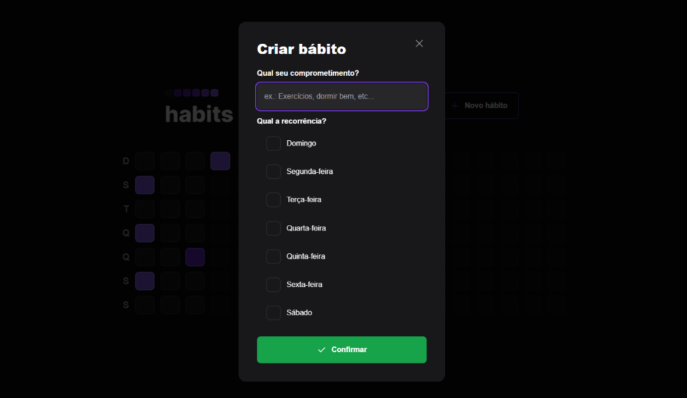

<h1 align="center">habit web-NLW SETUP Rocketseat</h1>

  

Aplicação front-end desenvolvida para registro de hábitos pessoais. Projeto fullstack desenvolvido junto ao evento NLW da Rocketseat. Possui funcionalidades de criação, listagem e atualização de hábitos. Consome uma API REST que foi desenvolvida em nodejs para essa aplicação.

## Tecnologias e ferramentas :wrench:

- vite
- React
- typescript
- tailwindcss
- postcss
- phosphor-react
- dayjs
- radix
- axios

### Layout

